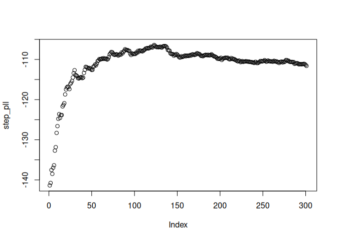
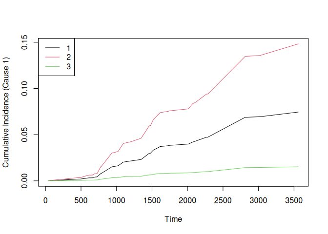

<!-- README.md is generated from README.Rmd. Please edit that file -->

# CoxBoost

<!-- badges: start -->

[](https://github.com/binderh/CoxBoost/actions/workflows/r-cmd-check.yml)
[](https://cran.r-project.org/package=CoxBoost)
<!-- badges: end -->

Cox-Likelihood Based Boosting for right-censored single-event survival
tasks and competing risks.

## Installation

You can install the development version of CoxBoost from
[GitHub](https://github.com/binderh/CoxBoost/) with:

``` r
# install.packages("pak")
pak::pak("binderh/CoxBoost")
```

## Examples

We provide two basic examples which show how to fit a `CoxBoost` model
and predict on new data.

### Single-event data

First, we generate some survival data with 10 informative covariates and
define the train and test sets:

``` r
library(CoxBoost)
set.seed(42)

# generate survival data
n = 200; p = 100
beta = c(rep(1,10),rep(0,p-10))
x = matrix(rnorm(n*p),n,p)
real.time = -(log(runif(n)))/(10*exp(drop(x %*% beta)))
cens.time = rexp(n,rate=1/10)
status = ifelse(real.time <= cens.time,1,0)
obs.time = ifelse(real.time <= cens.time,real.time,cens.time)

# define training and test set
train.index = 1:150
test.index = 151:200
```

We fit CoxBoost to the training data and see the model’s `summary()`:

``` r
cbfit = CoxBoost(
  time = obs.time[train.index],
  status = status[train.index],
  x = x[train.index,],
  stepno = 300, penalty = 100
)

summary(cbfit)
```

    # 300 boosting steps resulting in 67 non-zero coefficients  
    # partial log-likelihood: -353.4452 
    # 
    # parameter estimates > 0:
    #  V1, V2, V3, V4, V5, V6, V7, V8, V9, V10, V11, V12, V15, V20, V21, V23, V30, V31, V33, V34, V37, V38, V41, V47, V48, V49, V60, V63, V71, V73, V74, V77, V78, V80, V82, V87, V90, V91, V96, V97 
    # parameter estimates < 0:
    #  V13, V18, V22, V24, V27, V28, V32, V36, V40, V42, V44, V51, V52, V53, V56, V59, V67, V69, V70, V72, V76, V83, V84, V86, V89, V93, V99

Plot the mean partial log-likelihood for test set in every boosting
step:

``` r
step_pll = predict(
  cbfit,
  newdata = x[test.index,],
  newtime = obs.time[test.index],
  newstatus = status[test.index],
  at.step = 0:300, type = "logplik"
)

plot(step_pll)
```

<!-- -->

Names of covariates with non-zero coefficients at boosting step with
maximal test set partial log-likelihood:

``` r
print(cbfit$xnames[cbfit$coefficients[which.max(step_pll),] != 0])
```

    #  [1] "V1"  "V2"  "V3"  "V4"  "V5"  "V6"  "V7"  "V8"  "V9"  "V10" "V12" "V18"
    # [13] "V20" "V24" "V27" "V30" "V31" "V32" "V33" "V37" "V38" "V41" "V42" "V44"
    # [25] "V53" "V56" "V59" "V63" "V69" "V71" "V72" "V73" "V76" "V78" "V80" "V82"
    # [37] "V84" "V87" "V99"

We refit the `CoxBoost` model but with covariates 1 and 2 as mandatory:

``` r
cbfit_mand = CoxBoost(
  time = obs.time,
  status = status,
  x = x, 
  unpen.index = c(1,2), stepno = 100, penalty = 100
)

summary(cbfit_mand)
```

    # 100 boosting steps resulting in 45 non-zero coefficients (with 2 being mandatory) 
    # partial log-likelihood: -567.6112 
    # 
    # parameter estimates > 0:
    #  V1, V2, V3, V4, V5, V6, V7, V8, V9, V10, V11, V12, V20, V30, V31, V37, V38, V41, V49, V61, V63, V68, V71, V73, V78, V80, V85, V90, V97 
    # parameter estimates < 0:
    #  V24, V27, V32, V36, V45, V50, V52, V53, V59, V72, V76, V84, V88, V93, V99, V100 
    # Parameter estimates for mandatory covariates:
    #    Estimate
    # V1   0.9673
    # V2   0.9816

### Competing risks data

We use the `bpc` dataset from the `survival` package, perform a simple
trian/test split and fit a cause-specific hazard CoxBoost model:

``` r
library(survival)

# Use the pbc dataset from survival package
data(pbc)
# Create a competing risks variable: 0=censored, 1=death, 2=transplant
pbc$status2 = with(pbc, ifelse(status == 0, 0, ifelse(status == 1, 1, 2)))
pbc$sex = with(pbc, ifelse(sex == "m", 0, 1)) # CoxBoost doesn't support factors

# Keep only complete cases for simplicity
pbc2 = na.omit(pbc[, c("time", "status2", "age", "sex", "bili")])

# Train/test split
set.seed(42)
train_index = 1:300 # 300
test_index  = 301:nrow(pbc2) # 118

# Fit CoxBoost with cause-specific hazards
fit = CoxBoost(
  time    = pbc2$time[train_index],
  status  = pbc2$status2[train_index],
  x       = as.matrix(pbc2[train_index, c("age", "sex", "bili")]),
  stepno  = 300,
  penalty = 100,
  cmprsk  = "csh" # cause-specific hazards
)
```

Summary of the trained model:

``` r
summary(fit)
```

    # cause '1':
    # 300 boosting steps resulting in 3 non-zero coefficients  
    # partial log-likelihood: -90.05802 
    # 
    # parameter estimates > 0:
    #  bili 
    # parameter estimates < 0:
    #  age, sex 
    # 
    # cause '2':
    # 300 boosting steps resulting in 3 non-zero coefficients  
    # partial log-likelihood: -584.9952 
    # 
    # parameter estimates > 0:
    #  age, bili 
    # parameter estimates < 0:
    #  sex

Predict CIFs on the test set using the unique, sorted event (by any
cause) time points:

``` r
times = sort(pbc2$time[test_index][pbc2$status2[test_index] != 0])
cif_pred = predict(
  fit,
  newdata = as.matrix(pbc2[test_index, c("age", "sex", "bili")]),
  type = "CIF",
  times = times
)

str(cif_pred)
```

    # List of 2
    #  $ 1: num [1:118, 1:42] 1.58e-04 2.50e-04 4.08e-05 2.72e-04 2.28e-04 ...
    #  $ 2: num [1:118, 1:42] 0.000914 0.000526 0.001873 0.00042 0.001082 ...

The output prediction object is a list with two elements: one matrix for
each cause (death and transplant), with the cumulative incidence
function (CIF). Each matrix’s rows correspond to the test observations
and the columns to the time points.

We plot the CIF of the first cause and for the first 3 test patients:

``` r
matplot(times, t(cif_pred$`1`[1:3, ]), type = "l", lty = 1, col = 1:3,
        xlab = "Time", ylab = "Cumulative Incidence (Cause 1)")
legend("topleft", legend = 1:3, col = 1:3, lty = 1)
```

<!-- -->

# Citing CoxBoost

If you apply `CoxBoost` to *single-event* survival data, please cite:

    @article{Binder2008,
      title = {{A}llowing for mandatory covariates in boosting estimation of sparse high-dimensional survival models},
      author = {Harald Binder and Martin Schumacher},
      doi = {10.1186/1471-2105-9-14},
      issn = {14712105},
      issue = {1},
      journal = {BMC Bioinformatics},
      month = {1},
      pages = {1-10},
      pmid = {18186927},
      publisher = {BioMed Central},
      volume = {9},
      year = {2008}
    }

If you use `CoxBoost` for *competing risks* analyses, please cite:

    @article{Binder2009,
      title = {{B}oosting for high-dimensional time-to-event data with competing riks},
      author = {Harald Binder and Arthur Allignol and Martin Schumacher and Jan Beersmann},
      doi = {10.1093/BIOINFORMATICS/BTP088},
      issn = {1367-4803},
      issue = {7},
      journal = {Bioinformatics},
      month = {4},
      pages = {890-896},
      pmid = {19244389},
      publisher = {Oxford Academic},
      volume = {25},
      year = {2009}
    }
